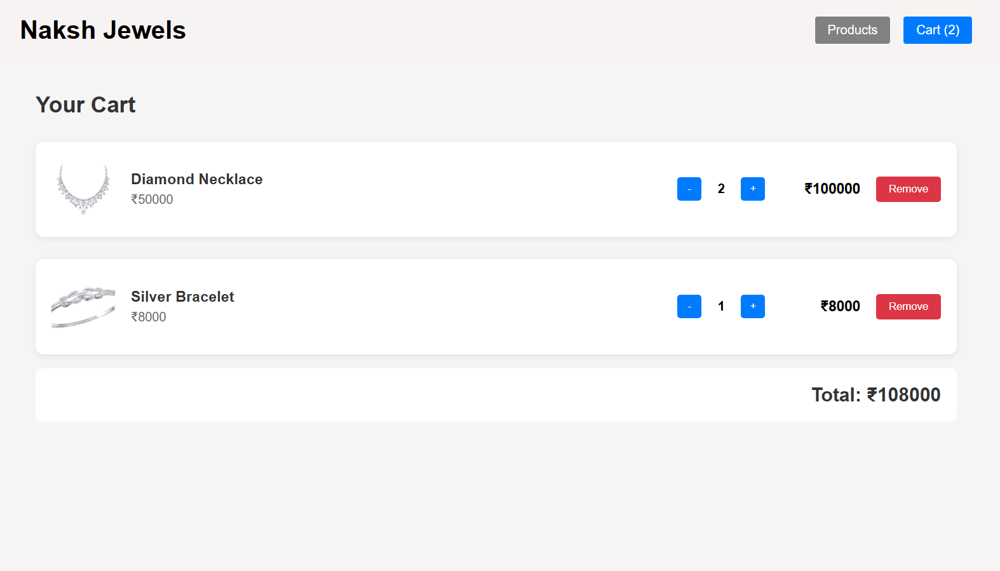
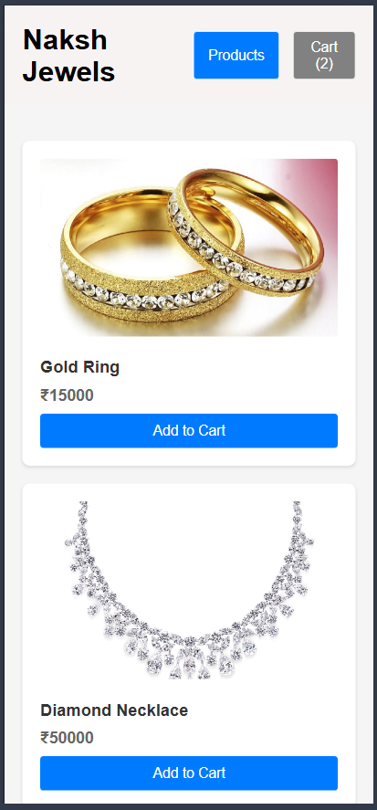
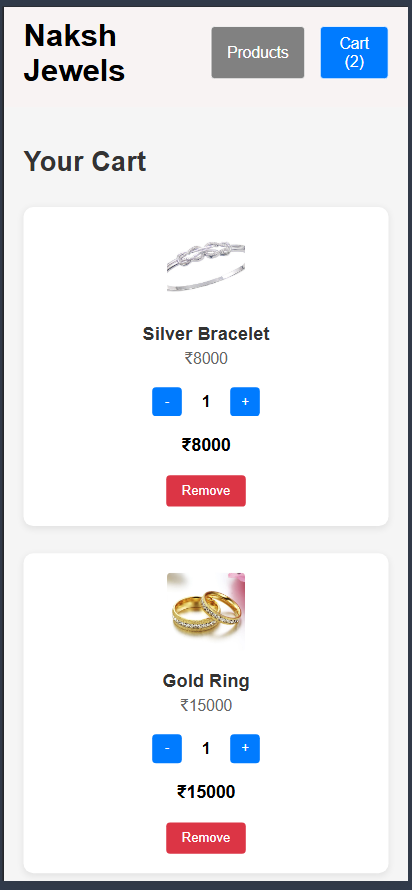

# Naksh Jewels E-Commerce

A mini e-commerce module built with React and Node.js.

## Features

- Product listing page
- Shopping cart with add/remove/update quantity
- State management using Context API
- Responsive design
- REST API backend
- Docker containerization

## Tech Stack

**Frontend:**
- React (functional components only)
- Context API for state management
- Custom CSS (no UI libraries)
- Axios for API calls

**Backend:**
- Node.js
- Express.js
- In-memory data storage
- Input validation middleware
- Error handling

**DevOps:**
- Docker
- Docker Compose
- Nginx (production server for frontend)


## Running Locally

### Backend
```bash
cd backend
npm install
npm run dev
```

Backend will run on http://localhost:5000

### Frontend
```bash
cd frontend
npm install
npm start
```

Frontend will run on http://localhost:3000

## Quick Start with Docker

### Run the Application
```bash
docker-compose up --build
```

Then open your browser:
```
http://localhost:3001
```

### Stop the Application
```bash
Ctrl + C
docker-compose down
```

## API Endpoints

### GET /products
Returns list of all products

**Response:**
```json
[
  {
    "id": 1,
    "name": "Gold Ring",
    "price": 15000,
    "image": "..."
  }
]
```

### POST /cart
Add item to cart

**Request Body:**
```json
{
  "productId": 1,
  "quantity": 2
}
```

**Response:**
```json
{
  "message": "Item added to cart",
  "cart": [...]
}
```

## Project Structure

```text
naksh-jewels/
├── backend/
│   ├── node_modules/
│   ├── .dockerignore
│   ├── .env
│   ├── .gitignore
│   ├── Dockerfile
│   ├── middleware.js
│   ├── server.js
│   ├── package.json
│   └── package-lock.json
│
├── frontend/
│   ├── node_modules/
│   ├── public/
│   ├── src/
│   │   ├── App.js
│   │   ├── App.css
│   │   ├── Cart.js
│   │   ├── CartContext.js
│   │   ├── Header.js
│   │   ├── ProductCard.js
│   │   └── index.js
│   ├── .dockerignore
│   ├── .gitignore
│   ├── Dockerfile
│   ├── package.json
│   └── package-lock.json
│
├── docker-compose.yml
└── README.md
```


## Assignment Compliance

- [x] Functional components only
- [x] No UI libraries (custom CSS)
- [x] Context API for state management
- [x] Clean folder structure
- [x] GET /products endpoint
- [x] POST /cart endpoint
- [x] Validation middleware
- [x] Error handling
- [x] Environment variables
- [x] Docker setup
- [x] docker-compose.yml


## Screenshots

### Products Page


### Cart


### Responsive Pages
<table>
  <tr>
    <td align="center">
      
    </td>
    <td align="center">
      
    </td>
  </tr>
</table>

## Development Notes

- Cart state is managed using React Context API
- Backend uses in-memory storage (array) for cart data
- Products are hardcoded in backend for simplicity
- Responsive design with CSS Grid and media queries
- Docker multi-stage build for optimized frontend image